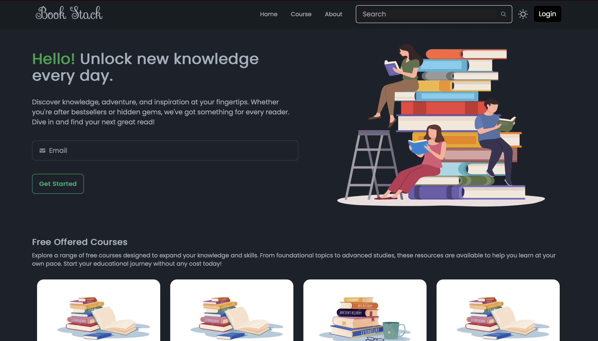
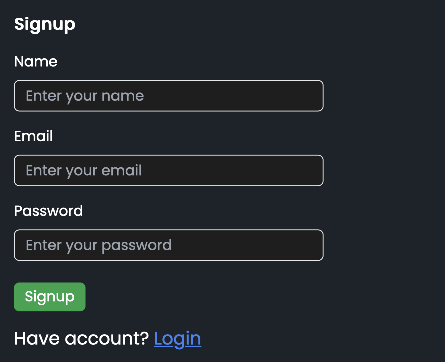
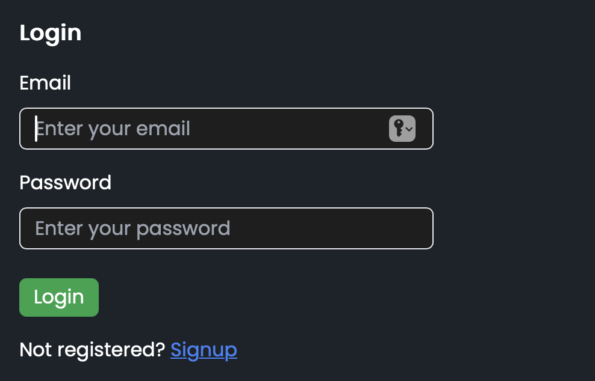

# Stack Store - Online Bookstore App

Stack Store is an online bookstore where users can browse, purchase, and manage books effortlessly. It includes secure user authentication, theme toggling (light/dark mode), and a responsive interface for an enhanced user experience.



---

## Features

- **User Authentication**: Secure login and signup for users using JWT and bcrypt.
- **Light/Dark Mode**: Switch between light and dark themes for comfortable browsing.
- **Responsive UI**: Built with Tailwind CSS & DaisyUI to work seamlessly across devices.
- **Book Browsing**: Explore books, filter free and paid courses/books, and view details.

---

## Tech Stack

- **Frontend**: React.js, Vite, React Router, React Hook Form, React Hot Toast
- **Backend**: Node.js, Express.js
- **Database**: MongoDB (Mongoose)
- **Styling**: Tailwind CSS, DaisyUI

---

## Screenshots

- **Signup Page**  

  

- **Login Page** 
 
  

---

## Installation & Setup

Follow these steps to run the project locally:

### 1. Clone the repository
```bash
git clone https://github.com/30namrata/BookStore.git
cd BookStore
```

### 2. Backend Setup
```bash
cd Backend
npm install
```
Create a `.env` file inside the `Backend` folder:
```env
PORT=4001
MongoDbURL=your_mongodb_connection_string
```
Start the backend server:
```bash
npm start
```

### 3. Frontend Setup
In a new terminal window:
```bash
cd Frontend
npm install
npm run dev
```

### 4. Access the App
Open your browser and visit:  
`http://localhost:5173`

---

## Contributing

Feel free to fork this repository and submit pull requests to improve the app!

---

## License

This project is licensed under the MIT License.